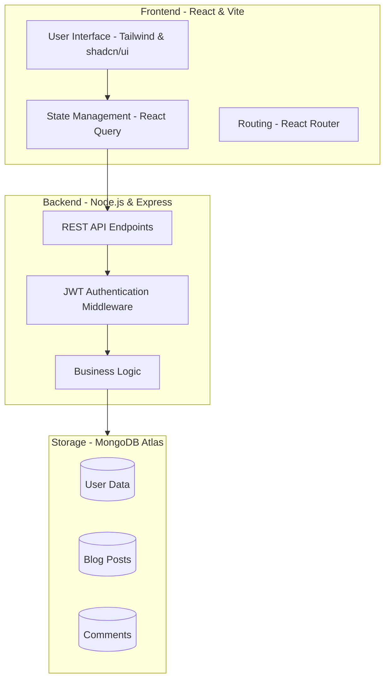
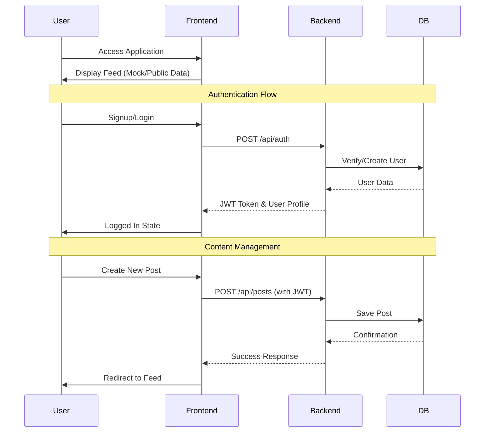

# 📝 E-Blogging App (Built with TypeScript)

<p align="center">
  
  
  
  
  
  
  
  
</p>

## 📌 Overview

This is a full-stack **E-Blogging web application** built using **TypeScript**. It allows users to create, edit, and delete blog posts, manage user authentication, and interact with other bloggers through a modern, responsive interface.

Whether you're a tech enthusiast, content creator, or developer, this app offers a solid platform for learning and collaboration.

---

## 🏗️ Architecture

The application follows a modern **Client-Server Architecture** with a decoupled frontend and backend.



### Core Components
- **Frontend**: A high-performance React application built with Vite, utilizing Tailwind CSS for styling and shadcn/ui for consistent, accessible components.
- **Backend**: A robust Express.js server providing a secure RESTful API, handling authentication, data processing, and communication with the database.
- **Database**: MongoDB Atlas serves as the NoSQL storage, providing flexibility for blog content and user-related data.

---

## 🔄 Application Workflow

The following diagram illustrates the typical user journey and data flow within the application.



### Key Workflows
1. **Authentication**: Users sign up or log in to receive a JSON Web Token (JWT). This token is stored locally and sent with subsequent requests to access protected routes.
2. **Content Creation**: Authenticated users can access the writing interface to draft and publish blog posts. The backend validates the user's session before saving the content to MongoDB.
3. **Engagement**: Users can interact with posts through likes and comments. The frontend provides real-time feedback while the backend updates the database asynchronously.

---

## 🚀 Features

- 🧑‍💻 User Registration & Login (JWT Auth)
- 📝 Create, Edit, and Delete Blog Posts
- 🔐 Authenticated Routes with Token Protection
- 🌐 RESTful APIs for communication between front-end and back-end
- 📦 MongoDB Database Integration
- 🔍 Real-time Post Updates
- 🎨 Responsive UI with Modern Component Library
- 🌙 Dark Mode Support
- 📊 Data Visualization
- 🎯 Advanced Form Handling with Validation

---

## 🛠️ Tech Stack

| Technology | Purpose |
|------------|---------|
| **TypeScript** | Type safety for both front & back |
| **React 18** | Frontend UI Framework |
| **Vite** | Fast build tool and dev server |
| **TailwindCSS** | Utility-first styling |
| **shadcn/ui** | High-quality React components |
| **React Router** | Client-side routing |
| **React Query (TanStack)** | Server state management |
| **React Hook Form** | Efficient form management |
| **Zod** | TypeScript-first schema validation |
| **Node.js** | Backend runtime |
| **Express.js** | API server & routing |
| **MongoDB** | NoSQL Database |
| **Mongoose** | MongoDB ODM |
| **JWT** | Authentication & Authorization |

---

## 📁 Project Structure

```
├── backend/             # Node.js/Express Backend API
│   ├── index.js         # Main server file
│   └── package.json     # Backend dependencies
├── src/                 # Frontend React application
│   ├── components/      # Reusable React components
│   ├── pages/           # Page components
│   ├── hooks/           # Custom React hooks
│   ├── services/        # API services
│   ├── lib/             # Utility functions
│   ├── types/           # TypeScript type definitions
│   └── App.tsx          # Main app component
├── public/              # Static assets
├── package.json         # Project dependencies
├── tsconfig.json        # TypeScript configuration
├── vite.config.ts       # Vite configuration
└── tailwind.config.js   # TailwindCSS configuration
```

---

## ⚙️ Installation & Setup

### Prerequisites
- **Node.js** (v16 or higher)
- **npm** or **yarn**
- **MongoDB Atlas** account

### Steps

1. **Clone the repository:**
```bash
git clone https://github.com/Samarssj/eBlogging-webapp.git
cd eBlogging-webapp
```

2. **Install frontend dependencies:**
```bash
npm install
```

3. **Install backend dependencies:**
```bash
cd backend
npm install
cd ..
```

4. **Configure environment variables:**
Create a `.env` file in the `backend/` directory:
```env
MONGODB_URI=your_mongodb_atlas_connection_string
JWT_SECRET=your_jwt_secret_here
PORT=5000
# Enables personalized topic suggestions through Gemini.
GEMINI_API_KEY=your_google_ai_studio_key
```

The writing page now includes a **Topic spark** panel. It sends the writer's optional focus and current draft context to the Express backend, which keeps the Gemini key private and returns five structured blog ideas. The backend queries Gemini's model catalog, chooses the newest compatible model that supports `generateContent`, caches that choice for 15 minutes, and falls back to `gemini-flash-latest` if discovery is temporarily unavailable. If `GEMINI_API_KEY` is not set, the app shows local starter ideas so the workflow can still be reviewed offline.

5. **Start the development server:**
```bash
npm run dev
```

---

## 📜 Available Scripts

- `npm run dev` - Start the frontend development server
- `npm run build` - Create optimized production build
- `npm run lint` - Run ESLint to check code quality
- `npm run preview` - Preview production build locally

---

## 🤝 Contributing

Contributions are welcome! Please follow these steps:

1. Fork the repository
2. Create a feature branch (`git checkout -b feature/AmazingFeature`)
3. Commit your changes (`git commit -m 'Add AmazingFeature'`)
4. Push to the branch (`git push origin feature/AmazingFeature`)
5. Open a Pull Request

---

## 📝 License

This project is licensed under the MIT License - see the LICENSE file for details.

---

**Happy Blogging! 🚀**
